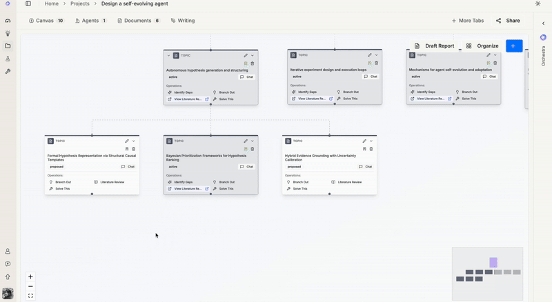

# Build AI Co-Scientists That Actually Help
**Moving beyond autonomous agents to collaborative research workflows**

**Co-Founder Amber(Jiachen) Liu**
November 2025 · 5 min read

---

**Note:** If you are familiar with me, you might know that earlier this year I built Curie, a fully autonomous AI Co-Scientist that automates scientific experiments. But over time, with more user studies and my own experience as a user, I can say that its usefulness is very limited. That experience motivated me to rethink the problem: how to build an AI co-scientist that truly helps with our researchers' daily workflow.

---

This blog post was created with **an AI Co-Scientist in a human-in-the-loop fashion**. All opinions and arguments are my own, but AI helped me discover relevant sources, enrich my arguments, and synthesize this document. In many ways, this post serves as a proof-of-concept for the central argument I'm making: that we need human-in-the-loop AI co-scientists, not fully autonomous ones.

My news feed is constantly buzzing with headlines claiming AIs like today Kosmos (Mitchener et al. 2025) can do six months of work in a day—reading 1,500 papers and writing 42,000 lines of code in a single run. It's exciting, but after the initial awe fades, a nagging question takes over: How does this help *me*?

A few months ago, I tried to reproduce one of these groundbreaking "AI scientist" papers, thinking it might offer a shortcut for a tedious analysis I was running. But the output was misaligned and unusable for my actual research topic, and I ended up having to do all the tedious work myself anyway. That skepticism isn't about the technology's potential; it's about the chasm between headline-grabbing breakthroughs and the daily, friction-filled grind of research. These systems feel like demos, not tools. They perform for the headlines but are useless for my workflow. 

### 🤖 From Black Box Oracles to Transparent Partners

That experience crystalized a problem many of us in research are feeling. The dominant paradigm of “AI scientist” often feels like a black-box oracle: you ask a question, and it delivers a final answer. If the answer is wrong, it’s often costly to correct them in the end. This forces us into a high-stakes, all-or-nothing gamble.

What the research community is realizing is that we don’t need an oracle. We need a lab partner. This is the core idea behind **Human-AI Interactive Research Workflows**: sustained, multi-step processes where humans and AI systems collaboratively build research artifacts. Instead of one big leap, we take many small, verifiable steps together.

**The Core Idea:** An interactive workflow is built on a few key pillars:

- **Task Decomposition:** Breaking a complex goal (e.g., "analyze this dataset") into smaller, inspectable subgoals.
- **Turn-Taking:** A clear protocol for how control shifts between the human and the AI. Who suggests the next step? Who verifies it? Who executes it?
- **Session Persistence:** A shared "lab notebook" or workspace where the history of our collaboration—the code, the assumptions, the failed attempts—is saved so we can pause, resume, and audit our work.

This shifts the AI's role from a know-it-all who delivers a final manuscript to a diligent assistant who says, "Here's the first step I'm proposing, and here are my assumptions. Does this look right to you?"

### ⚠️ The Old Way: The Perils of the One-Shot Answer

The baseline we're moving away from is the "one-shot" or "AI-led" system. You write a complex prompt, and the AI generates thousands of lines of code or a full analysis in one go. The appeal is obvious: maximum automation, minimum effort. But the drawbacks are severe:

- **Opacity:** The AI's reasoning is hidden. If it makes a subtle error in data cleaning, that error silently propagates through the entire analysis.
- **Brittleness:** These systems are sensitive to the initial prompt. A slightly ambiguous instruction can lead the AI down a completely wrong path, as I learned the hard way.
- **High Verification Cost:** Verifying a massive, monolithic output is often as much work as doing it yourself. As a study on research reproducibility found, fully AI-led teams can actually underperform human-only or AI-assisted teams, likely due to this verification burden (Brodeur et al., 2025).

This approach is fundamentally misaligned with the scientific process, which is iterative, exploratory, and full of backtracking and refinement.

### ✨ A Better Way: Building Workflows We Can Trust

Fortunately, a wave of research is focused on building this new generation of collaborative tools. Instead of aiming for a single, magical AI, these efforts provide practical scaffolding to make the human-AI partnership more transparent and effective. This is a deliberate move towards what some call incremental automation, prioritizing low-risk, high-reward steps first (Musslick et al., 2024).

Here's how researchers are doing things differently:

**1. Breaking Down the Problem (Decomposition):** Research from Kazemitabaar et al. (Kazemitabaar et al., 2024) explores two powerful models for this. A **Stepwise** interface breaks a task into tiny, sequential steps, each with editable assumptions. A **Phasewise** interface groups them into larger phases (e.g., data loading, analysis, plotting). Both give the user crucial intervention points.

*Fine-grained literature review.*

**2. Making Interaction Fluid (Better Interfaces):** Instead of just chat, new interfaces are emerging. The **BISCUIT** project (Cheng et al., 2024) introduces "ephemeral UIs" in notebooks—temporary widgets like sliders or forms that let you adjust the AI's parameters before code is even generated. Systems like **Flowco** (Freund et al., 2025) use a visual dataflow model, where each step in an analysis is a node you can inspect and debug.

*Free-style brainstorming with Research Canvas.*

**3. Creating a Shared Memory (Persistent Architectures):** To support long-term collaboration, we need a persistent, shared context. Conceptual frameworks like the three-layer architecture (Interaction, Process, Infrastructure) (Wang & Lu, 2025) propose making the *process* itself a first-class, inspectable object. Multi-agent systems like `freephdlabor` (Li et al., 2025) use a shared, file-based workspace as a reliable source of truth, preventing the information decay that happens when agents just pass text messages to each other.

The difference between these two approaches is stark. It's not just a technical distinction; it's a philosophical one about the role of technology in science.

| Feature | Autonomous AI | Human-in-the-Loop |
| :--- | :--- | :--- |
| **Primary Goal** | Replace human researcher | Augment human researcher |
| **Human Role** | Passive supervisor | Active collaborator |
| **Interaction** | Fire-and-forget; black box | Transparent, editable (Feng et al.) |
| **Control** | AI holds primary agency | Human retains ultimate control |
| **Workflow** | Operates in a silo | Integrated into tools (Wang et al.) |
| **Evidence** | Often degrades performance (Vaccaro et al.) | Sustained utility (Long et al.) |

*Table 1: Comparison of autonomous vs. human-in-the-loop AI co-scientist paradigms*
### 🔬 What the Evidence Says

This isn't just theory; early experiments show these interactive approaches work.

**🎯 Making steps visible gives users control**

In a controlled study comparing a standard chatbot against Stepwise and Phasewise interfaces for data analysis, Kazemitabaar et al. found that both decomposition methods gave users a significantly higher sense of control. More importantly, it made verifying the AI's work and intervening to correct its course far easier (Kazemitabaar et al., 2024). This directly addresses the failure mode of black-box systems.

*Human-in-the-loop brainstorming.*

**🎯 Assistance beats full automation for complex tasks**

A large-scale study by Brodeur et al. had teams of researchers assess the reproducibility of scientific papers. They found that teams *assisted* by AI performed just as well as human-only teams, and both significantly outperformed the *AI-led* teams where humans were only minimal guides (Brodeur et al., 2025). This provides strong evidence that for nuanced research tasks, the most effective role for AI today is as a collaborator, not an autonomous replacement.

*Controllable experiments.*

*Transparent and reproducible experiments.*

### 🧭 Open Questions and the Road Ahead

We're just at the beginning of this journey, and many hard questions remain.

- **What's the right level of granularity?** When is it better to show five small steps versus one big phase? The answer likely depends on the user's expertise and the task's complexity.
- **How do we build a truly persistent memory?** LLM context windows are finite. We need robust techniques for session checkpointing and memory compaction without losing critical information.
- **How do we measure success?** We lack standard benchmarks for evaluating human-AI collaboration. We need metrics beyond task completion, like verification effort, user trust, and the reproducibility of the final result.
- **How do we make this robust?** The **StepFly** framework for automating troubleshooting guides shows that adding structure *offline* (like extracting a workflow graph from a document before execution) dramatically improves the reliability of online automation (Mao et al., 2025). How can we apply this principle more broadly?

### ✨ From Autonomous Agents to Empowering Tools
The vision of an AI that replaces the scientist is not only unhelpful, but profoundly uninteresting. The real challenge is that brilliant researchers spend far too much time mired in friction—wrestling with infrastructure, manually synthesizing literature, and managing administrative tasks—instead of focusing on discovery.

The exciting opportunity lies in building AI co-pilots that dissolve this friction. We need tools that handle the tedious work so researchers can focus on what matters. The future of AI in science isn't about removing the human from the loop; it's about designing a more creative, powerful, and joyful loop, giving every researcher the superpowers to ask big questions and find breakthrough answers.

### References

1. **Improving Steering and Verification in AI-Assisted Data Analysis with Interactive Task Decomposition** — Kazemitabaar et al., 2024
2. **Interaction, Process, Infrastructure: A Unified Architecture for Human-Agent Collaboration** — Wang et al., 2025
3. **BISCUIT: Scaffolding LLM-Generated Code with Ephemeral UIs in Computational Notebooks** — Cheng et al., 2024
4. **Build Your Personalized Research Group: A Multiagent Framework for Continual and Interactive Science Automation** — Li et al., 2025
5. **Flowco: Rethinking Data Analysis in the Age of LLMs** — Freund et al., 2025
6. **Cocoa: Co-Planning and Co-Execution with AI Agents** — Feng et al., 2024
7. **Texera: A System for Collaborative and Interactive Data Analytics Using Workflows** — Wang et al., 2024
8. **Comparing Human-Only, AI-Assisted, and AI-Led Teams on Assessing Research Reproducibility** — Brodeur et al., 2025
9. **When Combinations of Humans and AI Are Useful: A Systematic Review and Meta-Analysis** — Vaccaro et al., 2024
10. **Automating the practice of science – Opportunities, Challenges, and Implications** — Musslick et al., 2024
11. **Agentic Troubleshooting Guide Automation for Incident Management (StepFly)** — Mao et al., 2025
12. **Not Just Novelty: A Longitudinal Study on Utility and Customization of an AI Workflow** — Long et al., 2024
13. **SciOps: Achieving Productivity and Reliability in Data-Intensive Research** — Johnson et al., 2024
14. **Kosmos: An AI Scientist for Autonomous Discovery** — Mitchener et al., 2025
